<div align="center">



<br/>

**A production-shaped, API-first online shopping platform — built as independent Spring Boot microservices behind a Spring Cloud API Gateway, with a modern Next.js storefront and admin back-office.**

<br/>

<!-- status / meta -->
[](#-testing)
[](#-3d-architecture)
[](#)
[](#)

<!-- core stack -->
[](#)
[](#)
[](#)
[](#)
[](#)
[](#)
[](#)
[](#)

<br/>

### &nbsp;·&nbsp; [Architecture](#-3d-architecture) &nbsp;·&nbsp; [Features](#-features) &nbsp;·&nbsp; [Tech Stack](#-tech-stack) &nbsp;·&nbsp; [Quick Start](#-quick-start) &nbsp;·&nbsp; [Testing](#-testing) &nbsp;·&nbsp; [Docs](#-documentation) &nbsp;·&nbsp;

</div>

---

## ✨ Overview

**NovaMart** is a full-stack e-commerce platform engineered as **8 independently deployable Spring Boot services** — 7 domain microservices coordinated by a **Spring Cloud API Gateway**. It follows an **API-First** methodology with an **OpenAPI 3.0.3** contract, enforces **Database-per-Service** ownership, and executes checkout as a **distributed Saga** with automatic compensating transactions.

The storefront and admin dashboard are a single **Next.js 16 + React 19** application, fully typed in **TypeScript** and styled with **Tailwind CSS**.

> 🎓 **Academic context** — implements *"a Microservices architecture using an API-First approach for Online Shopping with Database-per-Service ownership and Distributed Saga transactions."* Design rationale lives in [`docs/architecture.md`](docs/architecture.md) and [`docs/viva-preparation.md`](docs/viva-preparation.md).

---

## 🧊 3D Architecture

<div align="center">



</div>

Requests flow **client → gateway → service**. The gateway is the single entry point: it handles routing, CORS, JWT verification, and header hygiene, then forwards to the owning service. Every service owns its **own database** and migrates it independently with **Flyway** — there are **zero cross-service SQL joins**.

| Service | Port | Database | Primary Responsibilities |
| :--- | :---: | :--- | :--- |
| 🌐 **API Gateway** | `8080` | — | Reverse proxy, CORS, JWT verification, header sanitization |
| 🔐 **Auth Service** | `8081` | `auth_db` | Registration, login, JWT rotation, address book, role moderation |
| 📦 **Product Service** | `8082` | `product_db` | Catalogue, categories, brands, specs, image uploads, reviews & ratings |
| 🛒 **Cart Service** | `8083` | `cart_db` | Persistent carts, wishlist, move-to-bag operations |
| 🧾 **Order Service** | `8084` | `order_db` | ⭐ Saga orchestrator, order tracking, invoices, coupon validation |
| 💳 **Payment Service** | `8085` | `payment_db` | Simulated gateway: authorizations, captures, refunds |
| 🏬 **Inventory Service** | `8086` | `inventory_db` | Real-time stock, pessimistic reservations, commits, releases |
| 🔔 **Notification Service** | `8087` | `notification_db` | Notification log, order confirmations, live unread tracking |

<details>
<summary><b>🔄 How the distributed Saga checkout works</b></summary>

<br/>

The **Order Service** orchestrates a 4-step transaction across service boundaries:

1. **Reserve** stock in Inventory (pessimistic lock) →
2. **Authorize + capture** payment in Payment →
3. **Commit** the reservation and create the order →
4. **Notify** the customer.

If **payment fails**, a **compensating transaction** automatically **releases the reserved stock**, keeping every service's database consistent without a distributed lock or two-phase commit.

</details>

---

## 🚀 Features

<table>
<tr>
<td width="50%" valign="top">

**🛍️ Storefront**
- Catalogue with search, category & brand filters
- ⭐ Star-rating filter (`minRating`) on search
- One-click wishlist heart + **Move to Bag**
- Persistent cart & full checkout flow
- Real-time coupon validation at checkout
- Verified-buyer reviews & 5★ rating breakdown
- Visual order timeline + **Buy Again** reorder
- Printable GSTIN tax invoices (`@media print`)
- Live unread notification badge

</td>
<td width="50%" valign="top">

**🛠️ Admin Back-Office**
- Analytics dashboard: revenue & order-status charts
- Product management with local image uploads
- Live stock control + low-stock alerts
- Coupon management (`PERCENTAGE` / `FIXED` / `FREE_SHIPPING`)
- User moderation: enable/disable + `USER ⇄ ADMIN`

**🏗️ Platform**
- Database-per-Service isolation (MySQL / H2)
- Distributed Saga with compensating rollbacks
- JWT auth with refresh-token rotation
- OpenAPI 3.0.3 contract + Swagger UI per service

</td>
</tr>
</table>

---

## 🧰 Tech Stack

**Backend**


-000000?style=flat-square&logo=jsonwebtokens&logoColor=white)


**Frontend**


**DevOps**


---

## ⚡ Quick Start

> **Prerequisites:** JDK 21, Node.js 20+, and (optionally) Docker.

### Option A — Zero-install local run (H2 in-memory) &nbsp;·&nbsp; *recommended*

Start all backend services:

```powershell
./start-local.ps1
```

Start the Next.js frontend:

```bash
cd frontend
npm install
npm run dev
```

| Surface | URL |
| :--- | :--- |
| 🛍️ Storefront | http://localhost:3000 |
| 🛠️ Admin Dashboard | http://localhost:3000/admin |
| 🌐 API Gateway | http://localhost:8080/api/v1 |

### Option B — Production-style run with MySQL 8

```bash
docker compose -f docker-compose.mysql.yml up --build
```

To stop the local services (Option A):

```powershell
./stop-local.ps1
```

---

## 🧪 Testing

| Suite | Command | Coverage |
| :--- | :--- | :--- |
| **Backend** (all modules) | `./mvnw clean test` | Unit + integration across every service |
| **Frontend** | `cd frontend && npm test` | Vitest component & unit suites |
| **Type check** | `cd frontend && npx tsc --noEmit` | Strict TypeScript across all routes |
| **API contract** | Lint `api-contract/openapi.yaml` | Valid OpenAPI 3.0.3 |

---

## 🔑 Demo Accounts

| Role | Email | Password | Access |
| :--- | :--- | :--- | :--- |
| 👑 **Administrator** | `admin@novamart.dev` | `Admin@12345` | Full admin: users, products, stock, coupons, orders |
| 🛍️ **Customer** | `demo@novamart.dev` | `Demo@12345` | Shopping, wishlist, reviews, checkout, order tracking |

> These are seeded demo credentials for local evaluation only.

---

## 📁 Project Structure

```
novamart/
├── api-gateway/            # Spring Cloud Gateway (:8080)
├── services/
│   ├── auth-service/       # :8081  auth_db
│   ├── product-service/    # :8082  product_db
│   ├── cart-service/       # :8083  cart_db
│   ├── order-service/      # :8084  order_db  ⭐ Saga orchestrator
│   ├── payment-service/    # :8085  payment_db
│   ├── inventory-service/  # :8086  inventory_db
│   └── notification-service/ # :8087  notification_db
├── shared/common-lib/      # Shared API, security & error contracts
├── frontend/               # Next.js 16 storefront + admin
├── api-contract/           # OpenAPI 3.0.3 spec + Redocly config
├── docs/                   # Architecture, database, API & design docs
├── infrastructure/         # Local infra assets
├── docker-compose.yml
├── docker-compose.mysql.yml
├── start-local.ps1 / stop-local.ps1
└── pom.xml                 # Maven multi-module reactor
```

---

## 📚 Documentation

| Doc | Description |
| :--- | :--- |
| [`docs/architecture.md`](docs/architecture.md) | System design, boundaries & Saga rationale |
| [`docs/database.md`](docs/database.md) | Per-service schemas & migrations |
| [`docs/api.md`](docs/api.md) | Endpoint reference |
| [`docs/design-system.md`](docs/design-system.md) | Frontend design system |
| [`docs/viva-preparation.md`](docs/viva-preparation.md) | Design defense & Q&A |
| [`api-contract/openapi.yaml`](api-contract/openapi.yaml) | Machine-readable API contract |

---

## 📄 License

No license file is currently included — all rights reserved by the author. Add a `LICENSE` file (e.g. MIT) to permit reuse.

<div align="center">

<br/>

**⚡ Built with Spring Boot · Spring Cloud · Next.js · React**

<sub>NovaMart Platform · microservices · API-first · database-per-service · distributed Saga</sub>

</div>
