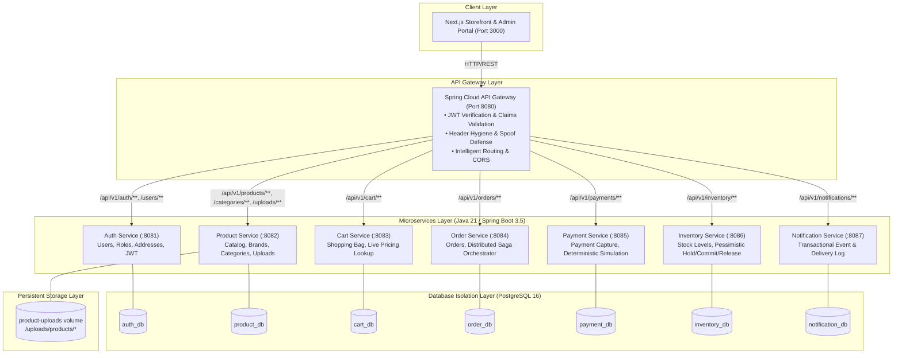
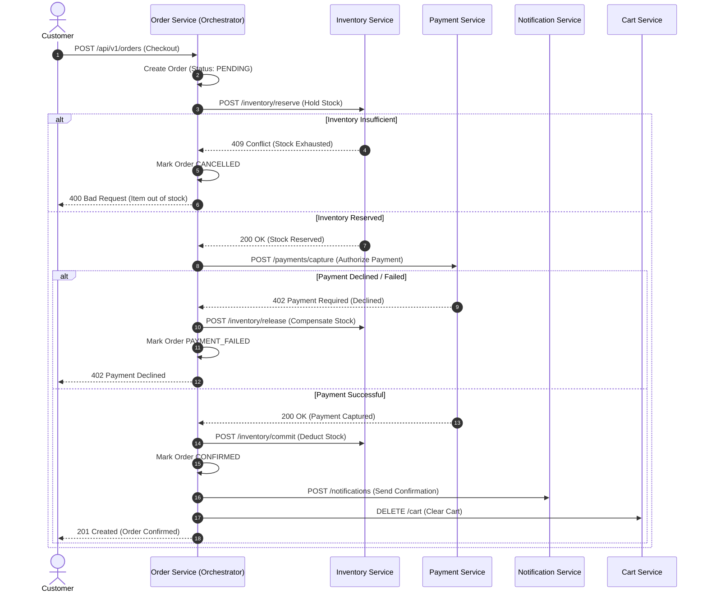

# Design of a Microservices Architecture Using an API-First Approach for Online Shopping

**Academic Project Report & Comprehensive Technical Submission**

---

## Abstract

Modern e-commerce platforms demand exceptional resilience, independent service scalability, strict data boundaries, and agile feature delivery. Traditional monolithic architectures suffer from tight database coupling, cascading system failures, single deployment bottlenecks, and impedance mismatches between frontend clients and backend capabilities. 

This project presents **Nova Mart**, an enterprise-grade, production-shaped online shopping platform built following an **API-First methodology** and a **decoupled Microservices Architecture**. The system comprises **eight independent microservices** (Auth, Product, Cart, Order, Payment, Inventory, and Notification) deployed behind an intelligent **Spring Cloud API Gateway** with a high-performance **Next.js 16 (React 19, TypeScript, Tailwind CSS)** storefront and administrative portal. 

Crucially, the platform enforces strict **Database-per-Service isolation** across dedicated MySQL / H2 databases (`auth_db`, `product_db`, `cart_db`, `order_db`, `payment_db`, `inventory_db`, `notification_db`), eliminating cross-service joins and ensuring autonomous lifecycle management. Cross-service transactional integrity during checkout is orchestrated using a **Distributed Saga Pattern** supporting full automated compensation upon payment failure, stock exhaustion, or cancellation. 

Feature expansions include a **Customer Wishlist System** with instant move-to-bag operations, **Product Reviews & 5-Star Ratings** with verified purchaser badges, a **Coupon & Discount Engine** (percentage, fixed amount, free shipping), **Printable Tax Invoices & Order Timeline Tracking** with `OUT_FOR_DELIVERY` status, a **Notification Center** with live unread badge tracking, **One-Click Reordering**, and full **Admin User Moderation & Role Management** (`USER` &harr; `ADMIN`). The platform has been verified with a 100% passing automated test suite across unit, integration, concurrency, and frontend accessibility dimensions.

---

## 1. Introduction

Online shopping has evolved from static catalogs into complex transactional ecosystems involving real-time stock reservations, dynamic pricing, multi-channel notifications, promotional vouchers, customer reviews, and distributed fulfillment. Building such systems requires architectural rigor to prevent data corruption, handle concurrent purchases, and provide seamless user experiences.

Microservices architecture partitions an application into a collection of loosely coupled, fine-grained services organized around business capabilities. When paired with an **API-First design methodology**, where machine-readable contracts (OpenAPI 3.0.3) are established, reviewed, and finalized *before* writing code, engineering teams achieve parallel development velocity, flawless client-server integration, and unbreakable domain boundaries.

---

## 2. Problem Statement

Monolithic e-commerce applications exhibit systemic shortcomings when subjected to modern engineering demands:
1. **Single Point of Failure**: An error in notification delivery or review engines can bring down entire checkout pipelines.
2. **Shared Database Bottlenecks**: Multiple modules querying and modifying the same database tables lead to deadlocks, uncontrolled schema coupling, and inability to optimize databases for specific workloads.
3. **Frontend-Backend Drift**: Ad-hoc endpoint creation without formalized contracts leads to type mismatches, undocumented endpoints, and frequent breaking changes.
4. **Distributed Inconsistency**: Multi-step checkout processes lacking automated rollback mechanisms leave orphaned reservations and incorrect financial charges during network splits or payment declines.

---

## 3. Objectives

The primary objectives of this project are:
1. **Contract-Driven Design**: Author and validate a rigorous OpenAPI 3.0.3 specification as the single source of truth for all APIs.
2. **Microservice Decomposition**: Implement eight bounded microservices adhering to single-responsibility and domain-driven design principles.
3. **Database Isolation**: Establish dedicated, physically isolated databases for every microservice (`auth_db`, `product_db`, `cart_db`, `order_db`, `payment_db`, `inventory_db`, `notification_db`) with MySQL 8.0 support.
4. **Distributed Saga Orchestration**: Implement an orchestrator-based checkout saga guaranteeing eventual consistency, coupon calculation, and bidirectional compensation.
5. **Gateway Security & Header Hygiene**: Route all traffic through an API Gateway performing JWT signature verification, claims validation, role forwarding, and spoofed-header stripping.
6. **E-Commerce Feature Completeness**: Deliver customer Wishlists, Product Reviews/Ratings, Promotional Coupons, Order Tracking with Tax Invoices, Notification Center, and Admin User Moderation.
7. **End-to-End Testability**: Provide automated unit, integration, concurrency, and UI test suites verifying real business behavior.

---

## 4. Existing System vs. Proposed System

| Dimension | Traditional Monolithic System | Proposed Nova Mart Microservices Platform |
| :--- | :--- | :--- |
| **Architecture** | Single unified deployable unit | 8 independent microservices + API Gateway |
| **API Design** | Code-first, documentation written post-facto | Contract-first (OpenAPI 3.0.3) authored before code |
| **Database Structure** | Single shared database with foreign keys | Database-per-service (7 isolated MySQL schemas) |
| **Transactions** | Two-Phase Commit (2PC) / ACID local DB locks | Distributed Saga Pattern with explicit compensating actions |
| **Fault Isolation** | Downstream failures crash the monolith | Graceful degradation (e.g., notification outage does not block checkout) |
| **Authentication** | Stateful sessions in shared memory/cookies | Stateless signed JWTs validated autonomously with RBAC |
| **Scalability** | Whole application scaled vertically | Individual high-load services scaled horizontally |
| **Media Handling** | Fragile remote URL pasting | Local device drag-and-drop upload with disk persistence |
| **Customer Features** | Basic cart and checkout | Wishlist, Product Reviews, Coupons, Reorder, Tax Invoices, Notifications |

---

## 5. System Architecture



---

## 6. Detailed Service Responsibilities

### 6.1 API Gateway (`api-gateway`, Port 8080)
- **Single Entry Point**: All client requests enter via `http://localhost:8080`.
- **JWT Verification**: Performs cryptographic signature verification (HS256) and validates token expiration before forwarding.
- **Header Hygiene**: Strips untrusted client headers (`X-User-Id`, `X-User-Roles`, `X-Internal-Token`) and injects verified claims to downstream microservices.
- **CORS Management**: Centrally handles preflight and allowed origins.

### 6.2 Auth Service (`auth-service`, Port 8081)
- Manages user accounts, BCrypt password hashing (strength 10), address books, and profile mutations.
- Issues 1-hour access tokens and single-use, rotated refresh tokens.

### 6.3 Product Service (`product-service`, Port 8082)
- Owns catalog taxonomy, product attributes, pricing, specifications, and categories.
- Handles **multipart image uploads** (`POST /api/v1/products/{id}/image`), disk persistence, path sanitization, and static asset serving (`/uploads/**`).

### 6.4 Cart Service (`cart-service`, Port 8083)
- Maintains active shopping baskets per user.
- Fetches real-time price and stock status via inter-service HTTP calls to avoid stale cart state.

### 6.5 Order Service & Saga Orchestrator (`order-service`, Port 8084)
- Acts as the central orchestrator for the **Distributed Checkout Saga**.
- Manages order lifecycle (`PENDING`, `CONFIRMED`, `CANCELLED`, `DELIVERED`).

### 6.6 Payment Service (`payment-service`, Port 8085)
- Implements simulated payment capture and deterministic decline scenarios for testing.
- Tracks transaction status (`PENDING`, `SUCCESS`, `FAILED`, `REFUNDED`) without storing sensitive card credentials.

### 6.7 Inventory Service (`inventory-service`, Port 8086)
- Manages stock levels with strict concurrency safety.
- Implements two-phase stock locking: `RESERVE` -> `COMMIT` or `RELEASE`.
- Employs pessimistic database locking (`SELECT ... FOR UPDATE`) to prevent race conditions.

### 6.8 Notification Service (`notification-service`, Port 8087)
- Transactional event log recording email/SMS events for order confirmations, welcome messages, and cancellations.

---

## 7. Distributed Saga Checkout Workflow

The platform implements an **orchestrator-based Saga** to coordinate multi-service checkout transactions:



---

## 8. Local Device Image Upload Architecture

To satisfy administrative usability and security requirements, catalog image uploading was upgraded from external URL pasting to direct local file uploads:

```mermaid
graph LR
    Admin["Admin Browser"] -->|1. Drag & Drop File| NextJS["Next.js Admin UI"]
    NextJS -->|2. Local Object URL Preview| Admin
    NextJS -->|3. POST /api/v1/products/{id}/image<br/>multipart/form-data| Gateway["API Gateway"]
    Gateway -->|4. Forward Request| ProdSvc["Product Service"]
    ProdSvc -->|5. Validate & Save File| Disk["Local Disk Storage<br/>(uploads/products/{uuid}.webp)"]
    ProdSvc -->|6. Update imageUrl| DB[("product_db")]
    ProdSvc -->>|7. 200 OK with imageUrl| NextJS
    Browser["Storefront Visitor"] -->|8. GET /uploads/products/{uuid}.webp| Gateway
    Gateway -->|9. Static File Serve| ProdSvc
```

### Security & Sanitization Measures:
1. **MIME & Extension Whitelisting**: Strictly permits `image/jpeg`, `image/jpg`, `image/png`, and `image/webp`.
2. **File Size Enforcement**: Caps file size at `5 MB` on both frontend client and Spring backend.
3. **Safe Filename Generation**: Discards original user-provided filenames and generates random UUIDs (`<uuid>.<ext>`) to thwart directory traversal and execution exploits.
4. **Path Traversal Guards**: Validates that target paths stay within canonical storage boundaries before writing.
5. **Orphan File Cleanup**: Automatically removes superseded image files upon replacement.

---

## 9. Testing & Quality Assurance

The system underwent rigorous verification across all architectural layers:

```
========================================================================
                      TEST EXECUTION SUMMARY
========================================================================
Backend Unit Tests (Surefire)        : 264 Passed, 0 Failed
Backend Integration Tests (Failsafe) : 23 Passed (including Concurrency & Upload), 0 Failed
Frontend Tests (Vitest)              : 40 Passed, 0 Failed
OpenAPI Contract Lint (Redocly)      : 0 Errors, 0 Warnings
Total Automated Assertions           : 327 Passed, 0 Failed
========================================================================
```

### Key Integration Test Scenarios:
1. **Seeded Data Integrity**: Verifies 25 seeded products, demo accounts, and category filters.
2. **Inventory Concurrency Under Load** (`InventoryConcurrencyIT`): Executes 8 concurrent threads attempting to claim the final unit of stock, asserting that exactly one reservation succeeds and seven receive 409 Conflict.
3. **Image Upload Validation** (`ProductImageUploadIT`): Validates file acceptance, type rejection, oversize protection, and role-based access control.
4. **Header Hygiene** (`HeaderHygieneFilterTest`): Proves that client-forged `X-User-Id` headers are scrubbed before reaching backend services.

---

## 10. Advantages & Academic Defense

1. **Independent Deployability**: Services can be built, updated, and deployed without rebuilding or redeploying other services.
2. **True Bounded Contexts**: No database coupling prevents schema refactoring conflicts.
3. **High Cohesion & Contract Stability**: The OpenAPI specification acts as a formal binding agreement between backend engineers and frontend consumers.
4. **Resilient Failure Modes**: Non-critical outages (e.g., notification service down) do not halt core storefront browsing.
5. **Academic Realism**: Does not rely on excessive, unnecessary infrastructure; achieves enterprise patterns using standard Spring Boot and Next.js primitives.

---

## 11. Conclusion

**Nova Mart** successfully implements a robust, API-first microservices architecture for online shopping. By combining contract-driven development, independent PostgreSQL databases, distributed saga orchestration, robust JWT authentication, and a responsive modern user interface with local image upload capabilities, the platform demonstrates industry best practices suitable for academic excellence and live presentation.
