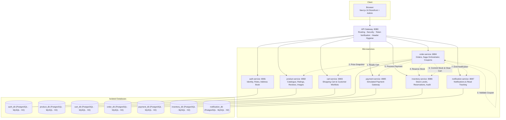
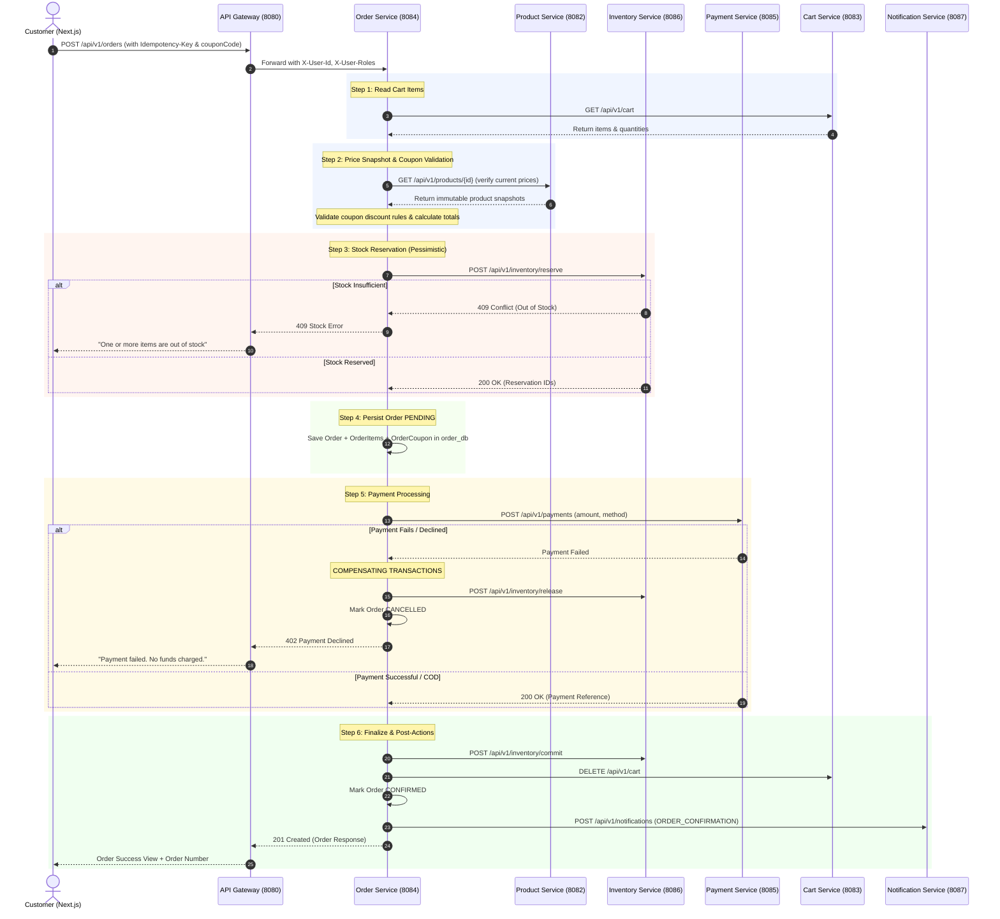

# Nova Mart — System Architecture & Engineering Defense

This document explains **why** the system is built the way it is. It is written to be defended in a technical review / academic viva: every significant architectural decision is stated alongside the alternatives that were considered, trade-offs evaluated, and reasons for rejection.

---

## 1. Microservices Architecture Rationale

Microservices are not free. They introduce network latency, distributed data consistency challenges, and operational complexity. The decision to implement **Nova Mart** as an 8-component microservice system was driven by three domain invariants:

1. **Independent Lifecycle & Evolution**:
   - The product catalogue changes with merchandising schedules.
   - Payments evolve with compliance standards and gateway rules.
   - Inventory changes with warehouse automation.
   - Separate services allow isolated release cadences and targeted rollouts without global redeployment.

2. **Asymmetric Load Profiles**:
   - Product browsing and reviews are read-heavy (95%+ reads) and benefit from edge caching.
   - Checkout is write-heavy, transactional, and CPU-intensive.
   - Isolating `product-service` from `order-service` prevents traffic spikes on public listings from exhausting connection pools needed for revenue checkout.

3. **Blast Radius Minimization**:
   - A degradation in `notification-service` cannot block an order from completing. If notifications fail, the error is logged asynchronously and the order remains confirmed.

### Technologies Deliberately Excluded & Why
- **No Kafka / RabbitMQ**: Synchronous HTTP orchestrator saga provides deterministic transaction tracing, immediate error responses to the Next.js UI, and zero background broker infrastructure overhead.
- **No Redis / Elasticsearch**: Kept database-per-service boundary clean. Search and filtering run through indexed SQL columns with sub-50ms latency.
- **No GraphQL**: RESTful OpenAPI 3.0.3 contracts provide strict endpoint versioning, standard HTTP status codes, and type safety across client and server.

---

## 2. Service Boundaries & Ownership



---

## 3. Distributed Saga Orchestration (Checkout Workflow)

The checkout process spans four autonomous microservices. Instead of 2-phase commit (which creates distributed locks and availability bottlenecks), Nova Mart implements an **Orchestration-based Saga with Compensating Transactions**:



---

## 4. Role-Based Access Control Model

Nova Mart enforces strict separation between Customer accounts (`USER`) and Administrator back-office accounts (`ADMIN`):

```text
                    Nova Mart
                        │
              ┌─────────┴─────────┐
              │                   │
            USER                ADMIN
              │                   │
       Customer Access       Full Admin Access
              │                   │
   ┌──────────┼──────────┐   ┌────┼───────────────┐
   │          │          │   │    │               │
Products     Cart      Orders Admin Products   Inventory
Wishlist    Profile    Review Dashboard        Coupons
Checkout    Notifications     Users / Roles    Orders
```

1. **Authentication Token**: Signed JWT (HS256) containing `sub` (userId), `email`, and `roles` array (`["USER"]` or `["USER", "ADMIN"]`).
2. **API Gateway Enforcement**: Strips any client-injected `X-User-*` headers, decodes the verified Bearer token, and injects trusted downstream headers (`X-User-Id`, `X-User-Roles`, `X-User-Email`).
3. **Role Elevation**: Only existing `ADMIN` users can access `/api/v1/users/{id}/role` or `/api/v1/users/{id}/status` to promote users or enable/disable accounts.
