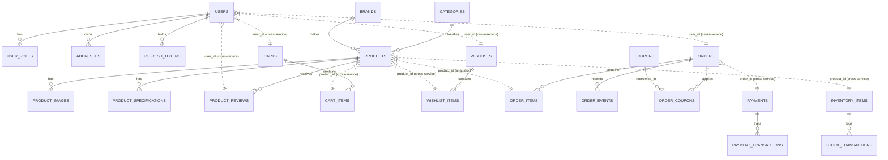

# Nova Mart — Database Architecture & Design

Seven microservice databases, one strictly per service. No service reads another service's tables, and there are no foreign keys across a service boundary.

---

## 1. Ownership Map & Schemas

| Database | Owning Microservice | Core Tables & Entities | Flyway Version |
| --- | --- | --- | --- |
| `auth_db` | `auth-service` (Port 8081) | `users`, `user_roles`, `addresses`, `refresh_tokens` | `V1`, `V2` |
| `product_db` | `product-service` (Port 8082) | `categories`, `brands`, `products`, `product_images`, `product_specifications`, `product_reviews` | `V1`, `V2`, `V3` |
| `cart_db` | `cart-service` (Port 8083) | `carts`, `cart_items`, `wishlists`, `wishlist_items` | `V1`, `V2` |
| `order_db` | `order-service` (Port 8084) | `orders`, `order_items`, `order_events`, `order_number_counter`, `coupons`, `order_coupons` | `V1`, `V2` |
| `payment_db` | `payment-service` (Port 8085) | `payments`, `payment_transactions` | `V1` |
| `inventory_db` | `inventory-service` (Port 8086) | `inventory_items`, `stock_transactions` | `V1`, `V2` |
| `notification_db` | `notification-service` (Port 8087) | `notifications` (`is_read` status) | `V1`, `V2` |

Each database carries its own isolated `flyway_schema_history` table for automated versioning and zero-downtime schema evolution.

---

## 2. Multi-Database Entity Relationships

Solid lines indicate real SQL foreign key constraints within the same database. Dashed lines indicate **cross-service logical references** (UUIDs / IDs resolved via asynchronous events or synchronous HTTP REST calls over the API Gateway).

---

## 3. Polyglot Database Dialect Compatibility (MySQL, PostgreSQL, H2)

Nova Mart supports multiple relational database engines without changing application code:
1. **MySQL 8.0 / 8.4** (Production & Academic Target via `docker-compose.mysql.yml` and `infrastructure/mysql/init.sql`).
2. **PostgreSQL 16** (Containerized standard via `docker-compose.yml`).
3. **H2 In-Memory** (Zero-install instant development & CI via `--spring.profiles.active=local`).

### Compatibility Decisions:
- **Monetary Precision**: All currency amounts, totals, discounts, and tax values are stored as `NUMERIC(12,2)` / `DECIMAL(12,2)`, mapped to Java's `BigDecimal`. Floating-point types (`FLOAT`, `DOUBLE`) are strictly forbidden.
- **UUID Portability**: All primary keys are stored as `VARCHAR(36)` strings generated in application code (`java.util.UUID`).
- **No Engine-Specific Constructs**: Schema migrations avoid non-portable keywords (`SERIAL`, `IDENTITY`, dialect-specific triggers, `jsonb`, and `ILIKE`). Case-insensitive searching uses `LOWER(column) LIKE LOWER(:term)`.
- **Dialect Escaping**: Flyway migration SQL scripts avoid reserved words across all three engines (e.g. `spec_value`, `sort_order`, `is_read`).

---

## 4. New Schema Enhancements

### A. Wishlists (`cart_db`)
- `wishlists`: `(id VARCHAR(36) PK, user_id VARCHAR(36) UNIQUE, created_at, updated_at)`
- `wishlist_items`: `(id VARCHAR(36) PK, wishlist_id FK, product_id VARCHAR(36), created_at)`
- Prevents duplicates via composite unique index on `(wishlist_id, product_id)`.

### B. Product Reviews & Ratings (`product_db`)
- `product_reviews`: `(id VARCHAR(36) PK, product_id VARCHAR(36), user_id VARCHAR(36), user_name VARCHAR(120), rating INT, title VARCHAR(180), comment TEXT, verified_purchase BOOLEAN, created_at, updated_at)`
- Index on `(product_id, created_at DESC)` for efficient listing.
- Automatic rating average & count rollup calculation.

### C. Promotional Coupons & Discounts (`order_db`)
- `coupons`: `(id VARCHAR(36) PK, code VARCHAR(30) UNIQUE, discount_type VARCHAR(20), discount_value DECIMAL(10,2), min_order_amount DECIMAL(10,2), max_discount DECIMAL(10,2), usage_limit INT, usage_count INT, active BOOLEAN, starts_at, expires_at, created_at, updated_at)`
- `order_coupons`: `(id VARCHAR(36) PK, order_id VARCHAR(36), coupon_id VARCHAR(36), code VARCHAR(30), discount_amount DECIMAL(10,2))`
- Full validation during Distributed Saga checkout.

### D. Read Tracking for Notifications (`notification_db`)
- `is_read BOOLEAN NOT NULL DEFAULT FALSE`
- Filtered index on `(user_id, is_read)` for instant unread badge counts (`GET /api/v1/notifications/unread-count`).
